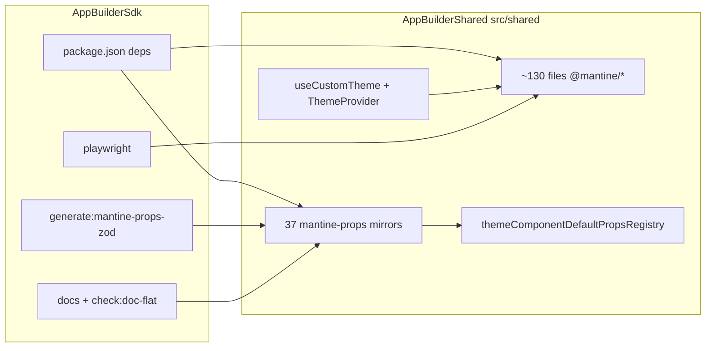

# Mantine 8 → 9 Migration — Design Spec

**Official guide:** [8.x → 9.x migration](https://mantine.dev/guides/8x-to-9x/)  
**Current:** `@mantine/*` `8.3.14`, React `19.2.4`  
**Target:** `@mantine/*` `9.4.0`, `recharts` `3.x` (peer of `@mantine/charts`)

## Goals

1. Upgrade all `@mantine/*` packages to Mantine 9 without regressing shipped product visuals.
2. Keep the **mantine-props** validation pipeline, TypeDoc/doc-flat, and theme JSON contract aligned with real Mantine types.
3. Land work in **phased PRs**: dependencies + compile → infra/docs → visual verification.

## Non-goals

- Adopting Mantine 9 visual defaults (`defaultRadius: md`, solid `light` variant, `fontWeights.medium: 600`).
- Refactoring unrelated theme architecture or component patterns.
- Codegen of mantine-props from `@mantine/core` `.d.ts`.

## Strategy (approved)

**Phased: deps → compile → visuals**

| Phase | Scope | Merge criterion |
| ----- | ----- | --------------- |
| **1 — Dependencies + compile** | Bump packages; mechanical API renames; `tsc` + unit tests green | No runtime visual QA required beyond smoke |
| **2 — Infra + docs** | mantine-props mirrors, subset asserts, `generate:mantine-props-zod`, `docs`, `check:doc-flat` | Validation pipeline green |
| **3 — Visual + E2E** | v8 visual pins, manual QA, Playwright snapshots | Visual parity with pre-migration baselines |

**Repos:** `AppBuilderShared` submodule (`src/shared`) + parent `AppBuilderSdk` (`package.json`, scripts, e2e).

**Branch naming (when implementation starts):** `task/SS-{number}-mantine-v9` (Jira key TBD).

---

## Visual parity policy (approved)

Preserve **v8-era visual semantics** — do not inherit Mantine 9 default styling changes.

| Mantine 9 change | Mitigation |
| ---------------- | ---------- |
| `defaultRadius` default `sm` → `md` | Keep explicit `defaultRadius` in `useCustomTheme` (`createTheme({ defaultRadius: "md" })` — **current product default**; audit components that omit `radius` and rely on theme default) |
| `light` variant uses solid colors | Compose [`v8CssVariablesResolver`](https://mantine.dev/guides/8x-to-9x/#light-variant-color-changes) with existing custom `CSSVariablesResolver` in `useCustomTheme` |
| `fontWeights.medium` `500` → `600` | Keep explicit `defaultFontWeightMedium: "500"` in `theme.other` (already set) and custom CSS vars (`--appbuilder-default-font-weight-medium`) |
| Notifications `pauseResetOnHover` | Add `pauseResetOnHover="notification"` on all `<Notifications>` mounts |

### `v8CssVariablesResolver` composition

`useCustomTheme` already returns a custom `resolver` with AppBuilder CSS variables. Mantine 9 requires merging, not replacing:

```typescript
import { v8CssVariablesResolver, type CSSVariablesResolver } from "@mantine/core";

function mergeCssVariablesResolvers(
  ...resolvers: CSSVariablesResolver[]
): CSSVariablesResolver {
  return (theme) =>
    resolvers.reduce(
      (acc, resolve) => {
        const next = resolve(theme);
        return {
          variables: { ...acc.variables, ...next.variables },
          light: { ...acc.light, ...next.light },
          dark: { ...acc.dark, ...next.dark },
        };
      },
      { variables: {}, light: {}, dark: {} },
    );
}

// useCustomTheme:
const resolver = mergeCssVariablesResolvers(v8CssVariablesResolver, appBuilderResolver);
```

`<Notifications>` update (3 entry points):

- `src/AppBuilderBase.tsx`
- `src/LibraryBase.tsx`
- `src/ExampleBase.tsx`

```tsx
<Notifications notificationMaxHeight={1000} pauseResetOnHover="notification" />
```

---

## Breaking changes checklist (from official guide)

Reference: https://mantine.dev/guides/8x-to-9x/

### Phase 1 — Mechanical (compile blockers)

| Change | Project impact | Action |
| ------ | -------------- | ------ |
| **React 19.2+** | `react` / `react-dom` `19.2.4` | None |
| **`Collapse` `in` → `expanded`** | `DrawingOptionsComponent.tsx` | Rename prop |
| **`Text` / `Anchor` `color` → `c`** | `MantineTextProps` mirror already has `c`; audit runtime `<Text>` / `<Anchor>` and theme `defaultProps` bags | Grep + fix; extend mirrors if `color` appears in schema-input |
| **`Grid` `gutter` → `gap`** | No `gutter=` usage found | None expected |
| **`Spoiler` `initialState` → `defaultExpanded`** | Not used | Skip |
| **`TypographyStylesProvider` → `Typography`** | Not used | Skip |
| **`Popover` / `Tooltip` `positionDependencies` removed** | Not used | Skip |
| **`use-form` `TransformValues` generic** | `AppBuilderFormWidgetComponent` uses `useForm` with custom validators (no `zodResolver`) | Fix only if generic inference breaks |
| **`@mantine/charts` + recharts 3** | Chart widgets (`AreaChart`, `BarChart`, `LineChart`, `DonutChart`, `PieChart`) | Add `recharts@3` to `package.json`; fix any chart API breaks |
| **Deep imports** | `Svg.tsx` imports `MantineSize` from `@mantine/core/lib/...` | Replace with public exports or mirror types after bump |
| **Hook splits** (`use-fullscreen`, `use-mouse`, `use-mutation-observer`) | Project uses **custom** `useFullscreen` in viewport entity — not `@mantine/hooks` | Verify grep; fix only if Mantine hooks are used elsewhere |
| **Hook type renames** (`UseScrollSpyReturnType`, etc.) | Not found | Skip unless `tsc` surfaces |
| **`useLocalStorage` / `useSessionStorage` typing** | Not used from `@mantine/hooks` | Skip unless `tsc` surfaces |

### Phase 2 — mantine-props + docs

Per `src/shared/shared/mantine-props/AGENTS.md` and root `AGENTS.md`:

1. After `@mantine/core` bump, run `pnpm exec tsc --noEmit` and fix `assert-mantine-subset.test-d.ts` failures.
2. Update affected `*.schema-input.ts` (prop renames, removed props, new unions) — **never** shrink mirrors to silence errors.
3. `pnpm run generate:mantine-props-zod` → commit schema-input + generated `*.zod.ts`.
4. `pnpm run docs && pnpm run check:doc-flat`.
5. `pnpm test -- validateAppBuilderSettingsJson themeRegistryDocParity`.

**37 mirrors** in `src/shared/shared/mantine-props/` — expect subset assert churn on shared primitives (`MantineStylesApi`, spacing tokens) even when runtime usage is unchanged.

### Phase 3 — Visual verification

- Manual smoke on representative `public/*.json` models (parameters, stacks, charts, notifications, anchors).
- `pnpm test-e2e` — update snapshots only where diffs are explained by intentional visual pins (should be minimal if v8 pins are correct).
- Compare `light` variant buttons/badges before/after (`v8CssVariablesResolver`).

---

## Architecture



### Key files

| Area | Files |
| ---- | ----- |
| **Deps** | Root `package.json` |
| **Providers** | `AppBuilderBase.tsx`, `LibraryBase.tsx`, `ExampleBase.tsx` |
| **Theme** | `src/shared/shared/ui/theme/useCustomTheme.ts` |
| **Mirrors** | `src/shared/shared/mantine-props/**` |
| **Subset asserts** | `assert-mantine-subset.test-d.ts` |
| **Registry** | `features/appbuilder/config/themeComponentDefaultPropsRegistry.ts` |
| **Charts** | `useCustomTheme.ts` (theme), `AppBuilder*ChartWidgetComponent.tsx` |
| **Forms** | `AppBuilderFormWidgetComponent.tsx`, `propsParameter.ts`, `propsExport.ts` |

---

## Phase deliverables

### Phase 1 PR — Dependencies + compile

**Parent repo:**
- Bump `@mantine/carousel`, `@mantine/charts`, `@mantine/core`, `@mantine/form`, `@mantine/hooks`, `@mantine/notifications` → `9.4.0`
- Add `recharts@^3` (explicit dependency for `@mantine/charts` peer)
- Fix deep imports and mechanical prop renames

**Submodule:**
- Runtime fixes (`Collapse`, `Text`/`Anchor`, chart widgets, any `tsc` errors)

**Verification:**
```bash
pnpm install
pnpm exec tsc --noEmit
pnpm test
```

### Phase 2 PR — Infra + docs

**Submodule:**
- Update mantine-props schema-input files + regenerate
- Fix subset asserts
- Update `@docLink` URLs in mirrors if Mantine doc paths change

**Verification:**
```bash
pnpm run generate:mantine-props-zod
pnpm run docs
pnpm run check:doc-flat
pnpm exec tsc --noEmit
pnpm test -- validateAppBuilderSettingsJson themeRegistryDocParity
```

### Phase 3 PR — Visual pins + E2E

**Parent + submodule:**
- `v8CssVariablesResolver` merge in `useCustomTheme`
- `pauseResetOnHover="notification"` on `<Notifications>`
- Confirm `defaultRadius` / font-weight pins documented in theme
- Playwright snapshot review/update
- Manual QA checklist (below)

---

## Manual QA checklist (Phase 3)

- [ ] Light/dark theme toggle — no unexpected color shifts on `variant="light"` controls
- [ ] Border radius on default Button/Input/Paper matches pre-migration
- [ ] Notification auto-close: hovering one notification does not pause others
- [ ] Drawing options collapse animation (`DrawingOptionsComponent`)
- [ ] Chart widgets render with recharts 3
- [ ] Carousel parameter selectors
- [ ] Markdown links (`MarkdownWidgetComponent` → `Anchor`)
- [ ] Theme JSON override from settings still applies (`themeOverrides.components.*.defaultProps`)

---

## Risks and mitigations

| Risk | Mitigation |
| ---- | ---------- |
| Large submodule diff | Phased PRs; phase 1 focused on `tsc` |
| Silent visual regressions (`color` → `c`) | Grep + manual QA; mirrors catch JSON-side renames |
| `recharts` 3 API breaks | Isolate chart widget fixes; test chart-heavy public JSON |
| Custom `cssVariablesResolver` + `v8CssVariablesResolver` merge bugs | Unit-test merge helper or snapshot CSS variables on a fixture theme |
| Customer `themeOverrides` JSON with removed props | Strict Zod rejects unknown keys — document breaking JSON keys in PR description |
| Deep import removal in `Svg.tsx` | Fix in phase 1 compile pass |

---

## Out of scope

- Migrating to Mantine 9 visual defaults (future product decision).
- `@mantine/tiptap` (not a dependency).
- `schemaResolver` migration for `@mantine/form` (no `zodResolver` in codebase today).
- Embedding official LLM migration markdown in repo (link only).

---

## Next step

After spec approval → invoke **writing-plans** skill to produce `docs/superpowers/plans/2026-06-26-mantine-v9-migration.md` with task-level checklist and commit boundaries per phase.
